# WEB-OSINTRA 🏫  
### OSIS Integrated Administration System

**WEB-OSINTRA** adalah sistem manajemen organisasi berbasis web yang dirancang untuk mendigitalisasi seluruh aktivitas OSIS, mulai dari manajemen anggota, program kerja, jabatan, divisi, transaksi keuangan, hingga audit aktivitas pengguna secara terintegrasi.

---

## 🛠️ Tech Stack

Dalam membangun website ini, kami menggunakan teknologi modern untuk memastikan performa dan keamanan:

| Komponen | Teknologi | Logo |
| :--- | :--- | :--- |
| **Frontend Framework** | React 19 + TypeScript |   |
| **Backend Framework** | Laravel 12 |  |
| **CMS & Bridge** | Inertia.js |  |
| **Database** | MySQL |  |
| **Styling** | Tailwind CSS 4.0 |  |
| **Animations** | GSAP & Framer Motion |   |
| **Build Tool** | Vite |  |

---

## 📁 Susunan Folder Project

Berikut adalah struktur folder utama dari proyek **WEB-OSINTRA**:

```text
WEB-OSINTRA/
├── app/                      # Logika Backend (Controllers, Models, Middleware)
├── bootstrap/                # Konfigurasi booting Laravel
├── config/                   # File konfigurasi aplikasi
├── database/                 # Migrations, Seeders, dan Factories
├── public/                   # Entry point (index.php) dan aset publik hasil build
├── resources/                # Sumber daya Frontend
│   ├── css/                  # File styling (Tailwind CSS)
│   ├── js/                   # Komponen React, Halaman (Pages), dan Logic JS
│   │   ├── components/       # Komponen UI Reusable
│   │   ├── Pages/            # Halaman utama aplikasi (Public & Dashboard)
│   │   └── Layouts/          # Layout template aplikasi
│   └── views/                # Blade template (Inertia root template)
├── routes/                   # Definisi route/URL (web.php)
├── screenshot/               # Dokumentasi Gambar Project
│   ├── internal/             # Screenshot Dashboard Admin
│   ├── login/                # Screenshot Halaman Login
│   └── public/               # Screenshot Halaman Publik
├── storage/                  # Penyimpanan logo, media, dan logs
├── artisan                   # CLI Laravel
├── composer.json             # PHP Dependencies (Laravel)
├── package.json              # JS Dependencies (React, Tailwind, Vite)
└── vite.config.ts            # Konfigurasi Vite Build Tool
```

---

## 📸 Tampilan Website

### 🌐 Tampilan Public
<p align="left">
  <strong>1. Homepage</strong><br>
  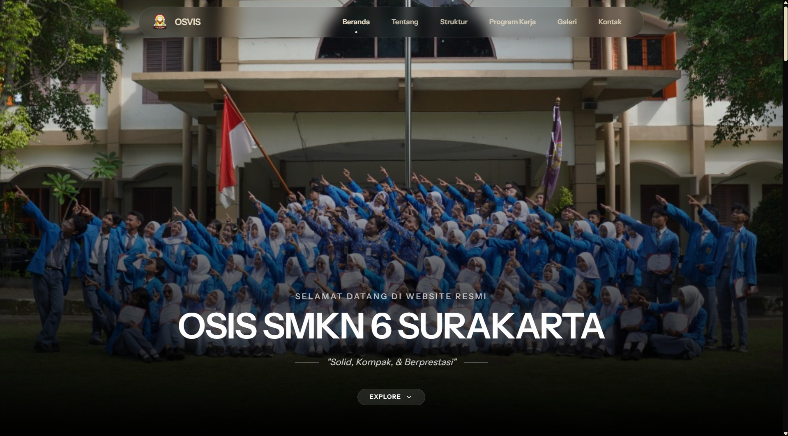
</p>

<p align="left">
  <strong>2. About</strong><br>
  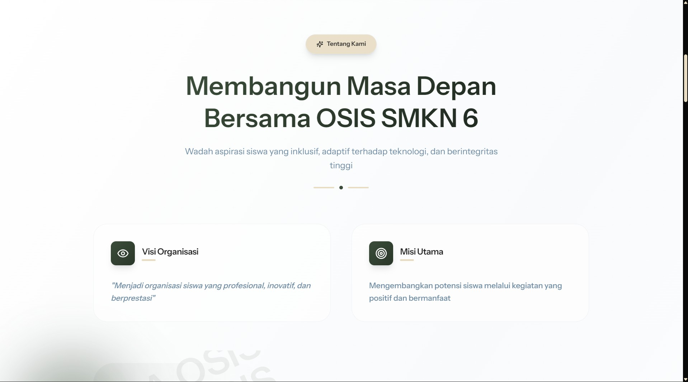
</p>

<p align="left">
  <strong>3. Sambutan</strong><br>
  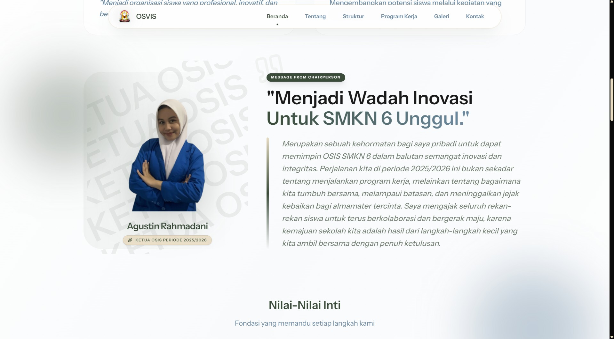
</p>

<p align="left">
  <strong>4. Struktur Organisasi</strong><br>
  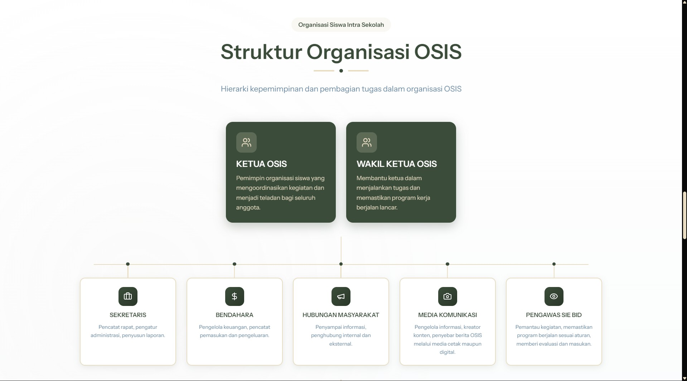
</p>

<p align="left">
  <strong>5. Galeri Kegiatan</strong><br>
  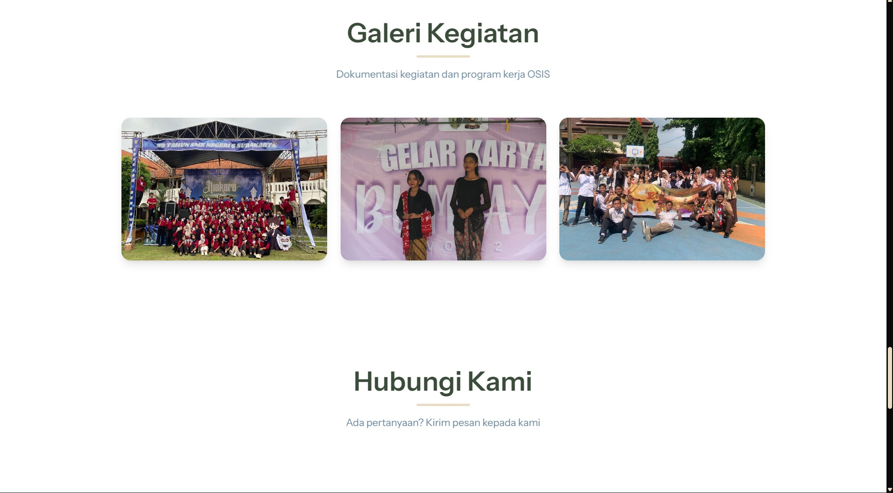
</p>

<p align="left">
  <strong>6. Contact</strong><br>
  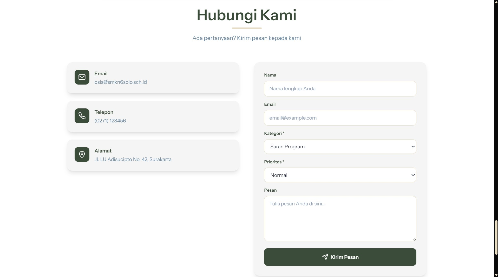
</p>

---

### 📊 Dashboard Internal
<p align="left">
  <strong>1. Login</strong><br>
  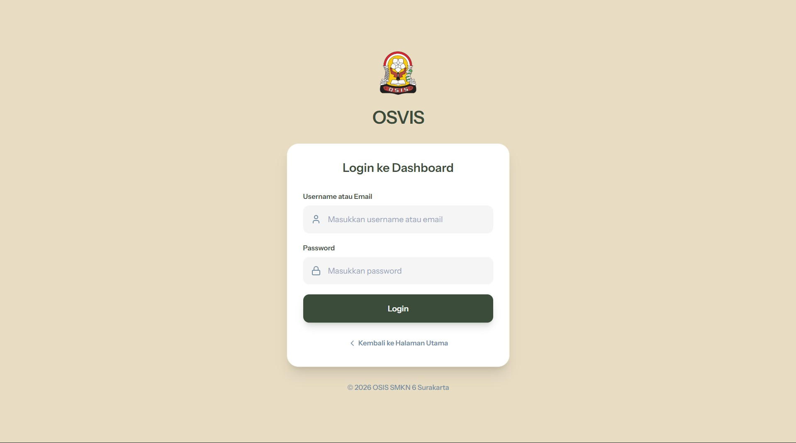
</p>

<p align="left">
  <strong>2. Dashboard Utama</strong><br>
  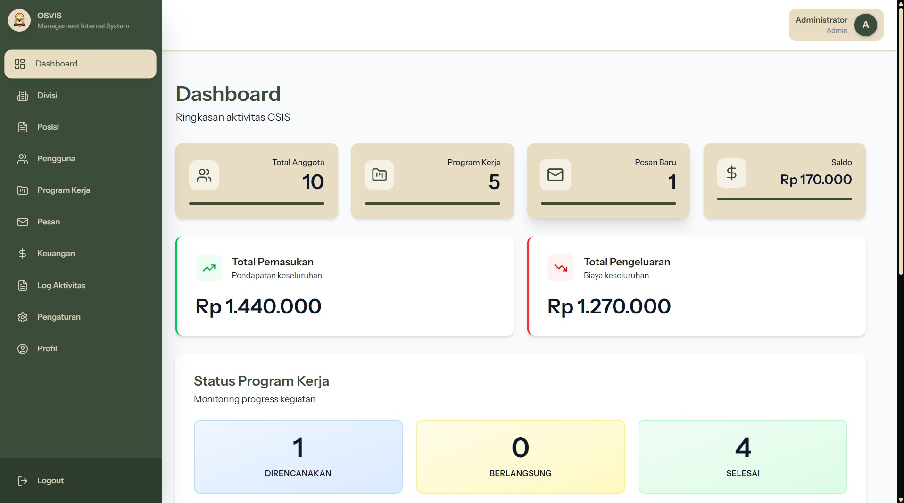
</p>

<p align="left">
  <strong>3. Manajemen Divisi</strong><br>
  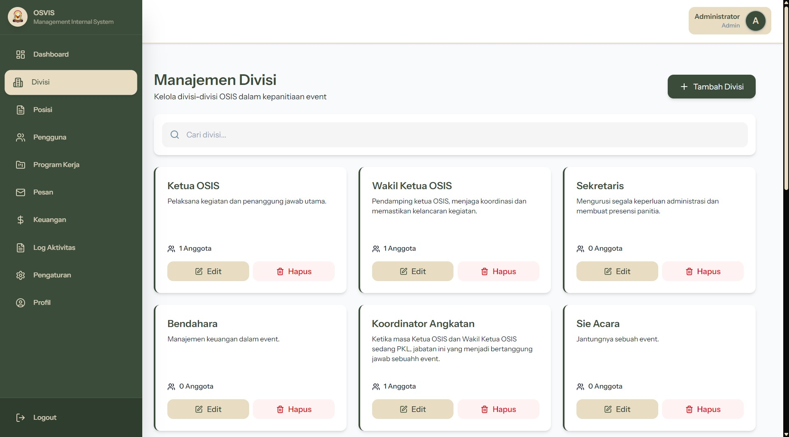
</p>

<p align="left">
  <strong>4. Manajemen Posisi/Jabatan</strong><br>
  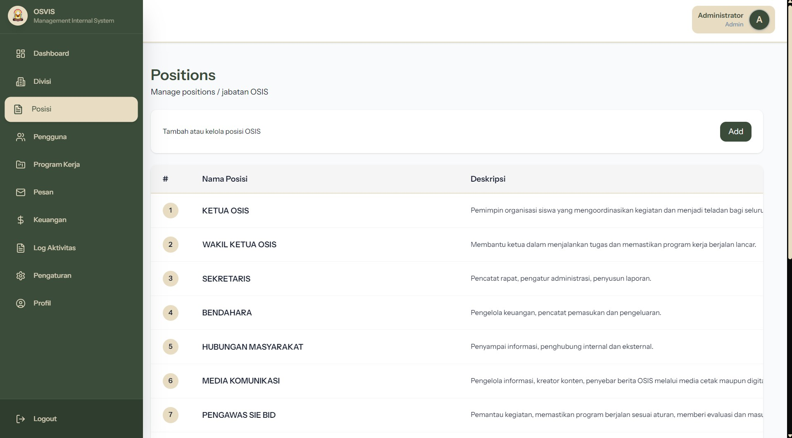
</p>

<p align="left">
  <strong>5. Manajemen Pengguna</strong><br>
  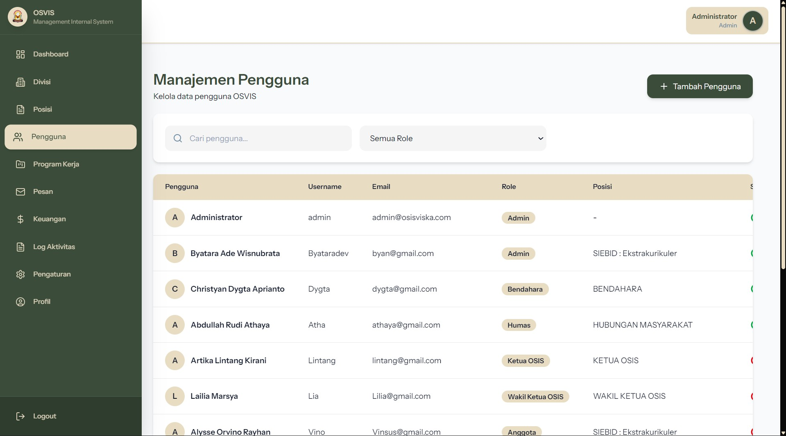
</p>

<p align="left">
  <strong>6. Program Kerja</strong><br>
  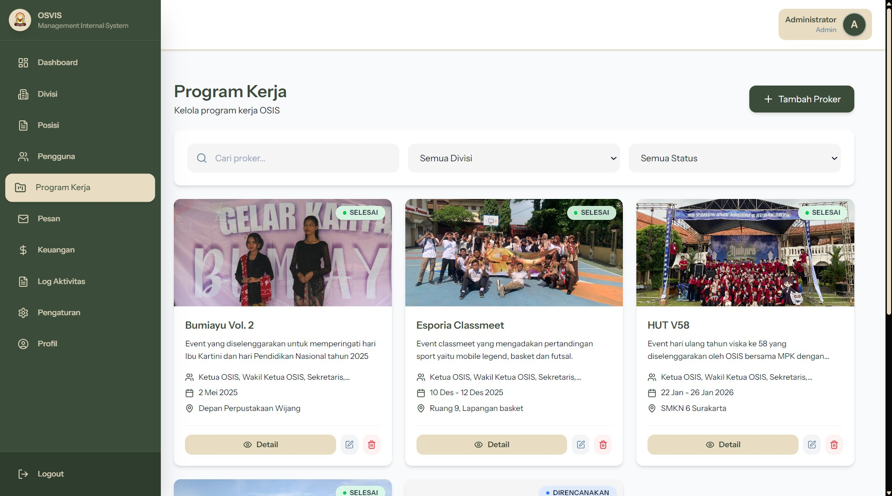
</p>

<p align="left">
  <strong>7. Pesan Masuk</strong><br>
  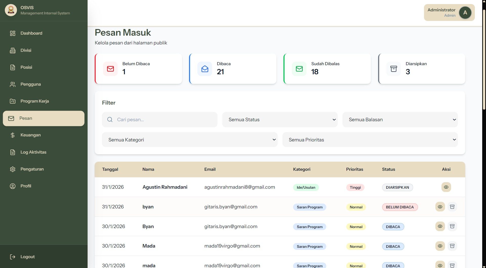
</p>

<p align="left">
  <strong>8. Laporan Keuangan</strong><br>
  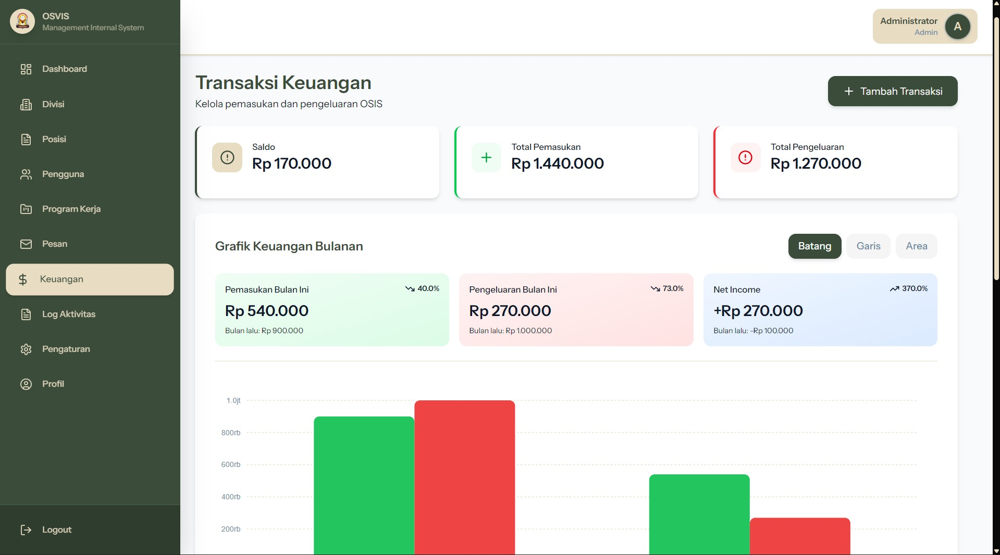
</p>

<p align="left">
  <strong>9. Log Aktivitas</strong><br>
  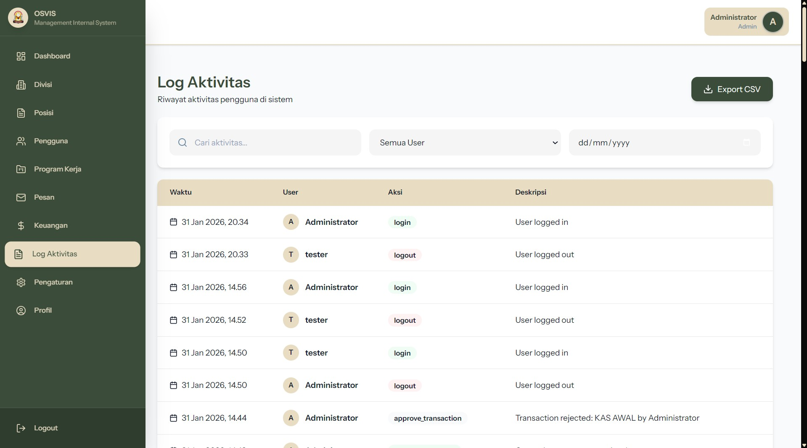
</p>

<p align="left">
  <strong>10. Pengaturan Aplikasi</strong><br>
  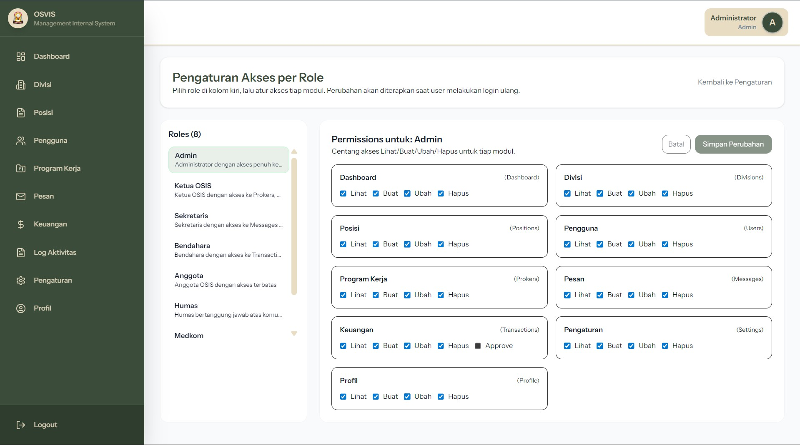
</p>

<p align="left">
  <strong>11. Profil Pengguna</strong><br>
  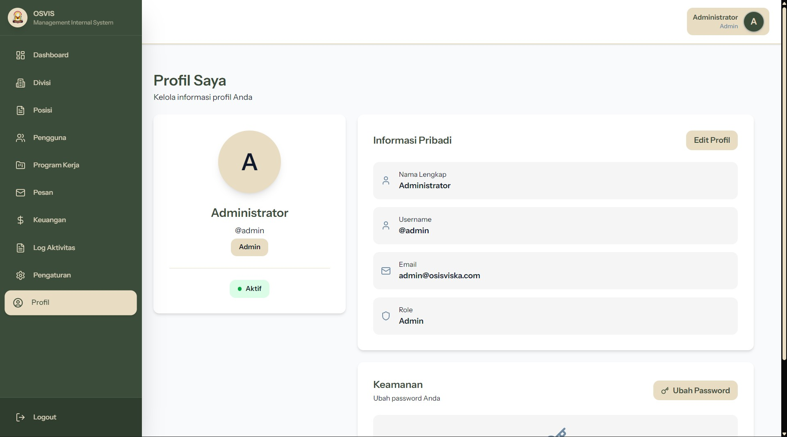
</p>

---

## 🚀 Status Proyek
Website sudah **FINAL**. Saat ini hanya tinggal menunggu perbaikan bug minor (jika ditemukan) sebelum benar-benar siap digunakan secara penuh.

---

## 👨‍💻 Developer
Dikembangkan dengan ❤️ oleh:
- **Roodiext Production**
- **ClaveoraDev**

---
© 2026 WEB-OSINTRA. All rights reserved.
